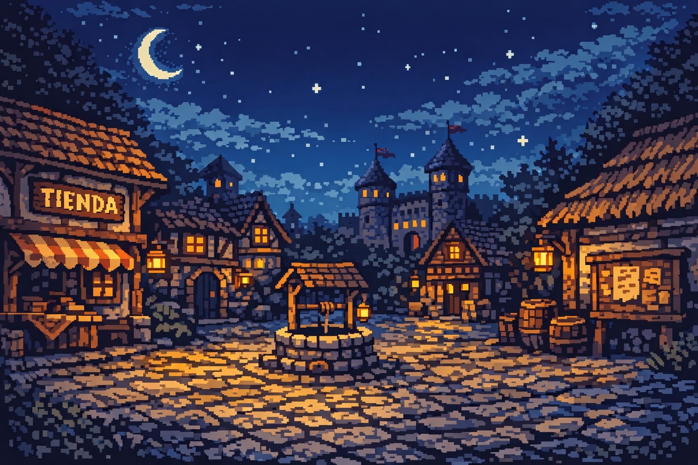
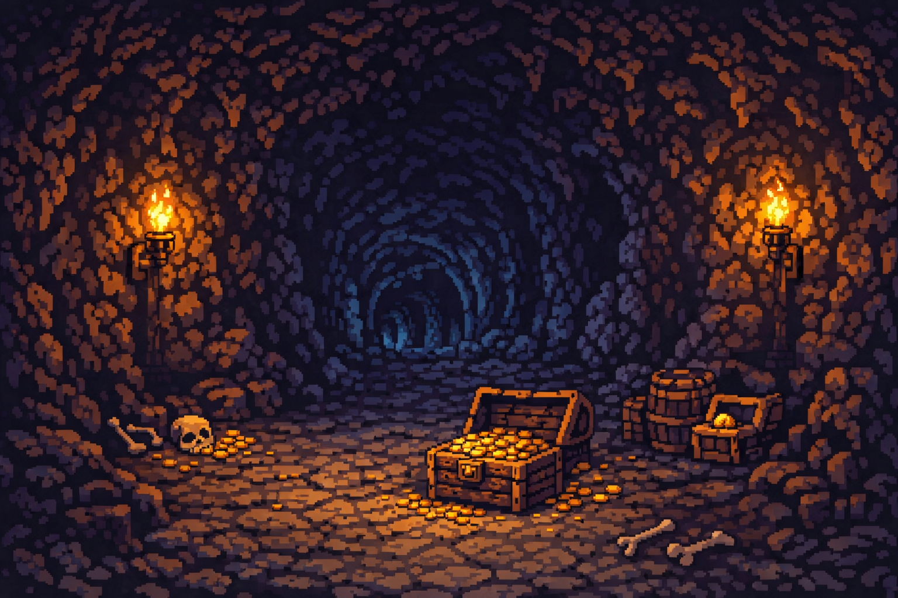
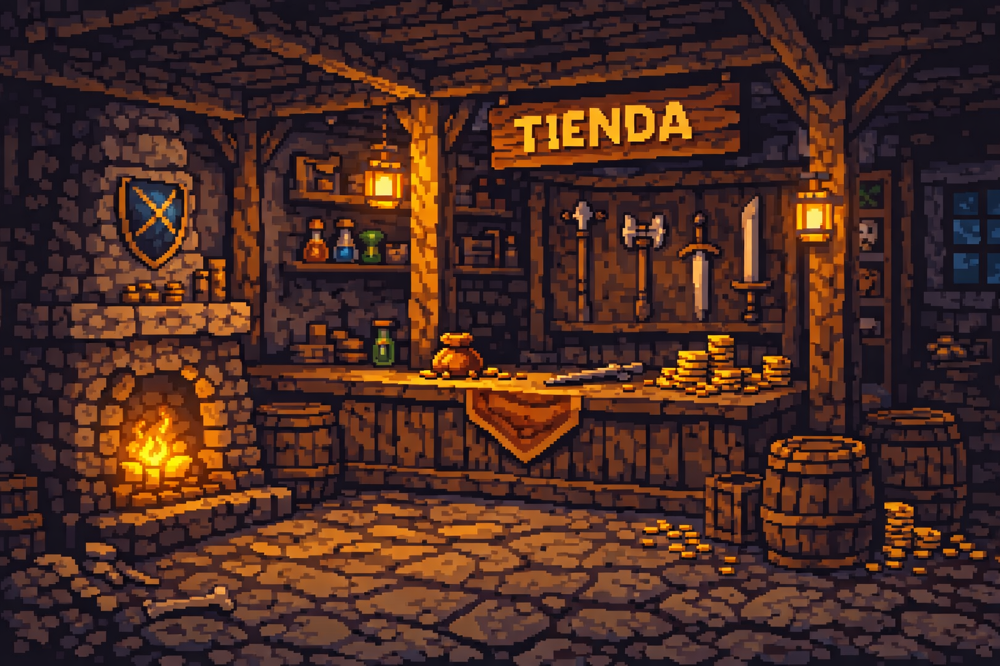
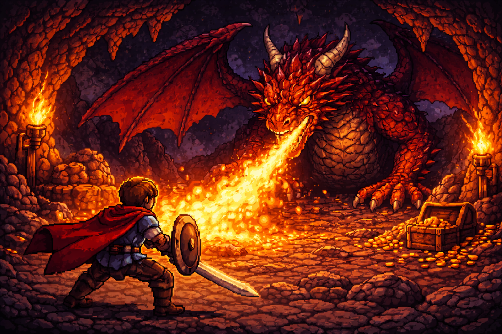

# RPG de práctica – JavaScript y DOM

Este proyecto es un **juego RPG en español** creado para practicar **ciclos, condicionales y manipulación del DOM en JavaScript**.  
Incluye armas, enemigos, ubicaciones con botones dinámicos y fondos de pantalla personalizados.

---

## 🎮 Cómo jugar

1. Abre `index.html` en tu navegador.  
2. Usa las **teclas de dirección** para moverte o interactuar con los botones de acción.  
3. Presiona las opciones en pantalla para luchar, comprar armas o regresar a la plaza.  
4. Recoge armas y objetos para mejorar tus habilidades.  
5. Derrota a los enemigos y avanza por nuevas zonas hasta enfrentarte al dragón final.

---

## Imágenes de fondo

- **Plaza del pueblo**  
  

- **Cueva**  
  

- **Tienda**  
  

- **Dragón final**  
  

---

## Armas disponibles

| Nombre               | Poder |  
|---------------------|-------|  
| Palo                 | 5     |  
| Daga                 | 30    |  
| Martillo de uña      | 50    |  
| Espada               | 100   |  
| Hacha de guerra      | 130   |  
| Lanza mística        | 160   |  
| Espada legendaria    | 200   |  

> Cada arma tiene un poder específico que afecta el daño en combate.

---

## Enemigos

| Nombre               | Nivel | Vida |  
|---------------------|-------|------|  
| Slime                | 2     | 15   |  
| Bestia colmilluda    | 8     | 60   |  
| Dragón               | 20    | 300  |  
| Esqueleto            | 12    | 100  |  
| Árbol maldito        | 15    | 150  |  

> Cada enemigo tiene habilidades y niveles que determinan su fuerza en batalla.

---

## Ubicaciones y acciones

| Ubicación            | Opciones principales | Imagen de fondo |
|---------------------|-------------------|----------------|
| Plaza del pueblo     | Ir a la tienda, Ir a la cueva, Luchar contra el dragón | `town.png` |
| Tienda               | Comprar salud, Comprar arma, Regresar | `shop.png` |
| Cueva                | Luchar contra Slime, Luchar contra Bestia, Regresar | `cave.png` |
| Combate              | Atacar, Esquivar, Huir | – |
| Dragón final         | –                 | `dragon.png` |

> Los botones cambian dinámicamente según la ubicación y la acción.

---

## Cambios realizados

- Se **agregaron tres armas nuevas** (Martillo de uña, Hacha de guerra, Lanza mística).  
- Se **añadieron dos enemigos nuevos**: Esqueleto y Árbol maldito.  
- Se **tradujeron los textos del juego al español**.  
- Se **incluyeron imágenes de fondo personalizadas**.  
- Se mejoró la interacción con el DOM y la actualización de botones por ubicación.

---

## Estructura del proyecto

/RPG
/assets
town.png
cave.png
shop.png
dragon.png
armas/
enemigos/
/js
main.js
data.js
/css
estilo.css
index.html
README.md
